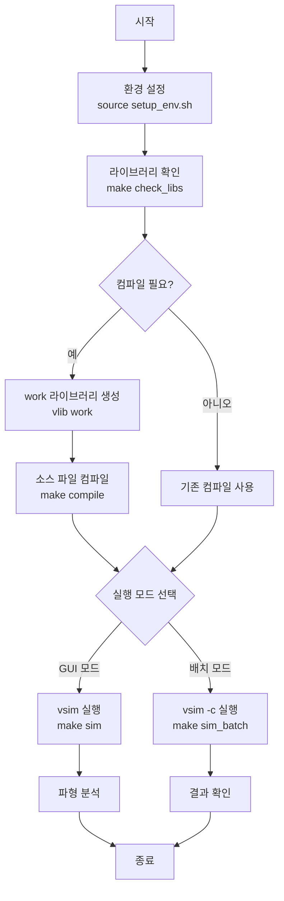
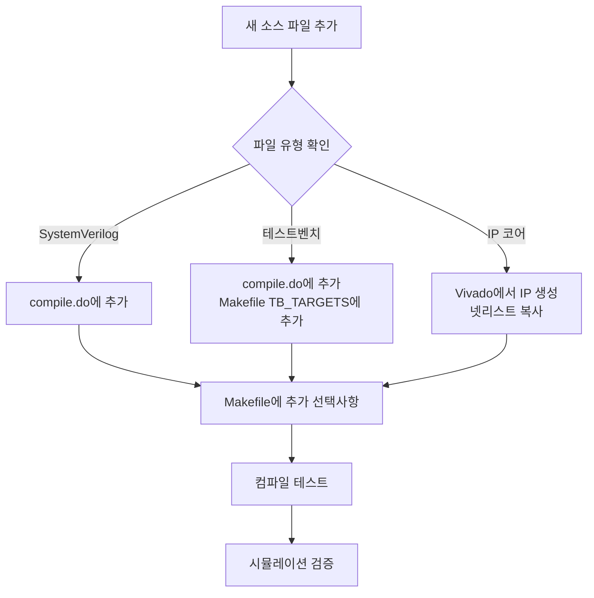
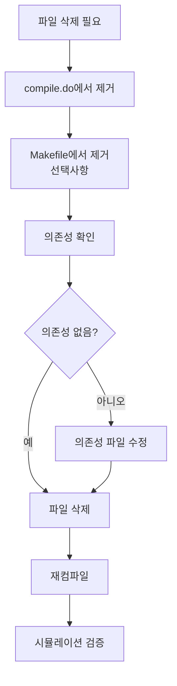

# BLUE-HD-FPGA QuestaSim 사용자 가이드

**버전**: 1.0.0
**최종 업데이트**: 2026-01-21
**상태**: 사용 가능

---

## 목차

1. [프로젝트 개요](#1-프로젝트-개요)
2. [필수 조건](#2-필수-조건)
3. [빠른 시작](#3-빠른-시작)
4. [상세 실행 가이드](#4-상세-실행-가이드)
5. [파일 관리](#5-파일-관리)
6. [문제 해결](#6-문제-해결)
7. [부록](#7-부록)

---

## 1. 프로젝트 개요

### 1.1 개요

본 가이드는 BLUE-HD-FPGA 프로젝트의 QuestaSim (ModelSim) 시뮬레이션 환경을 사용하는 방법을 설명합니다. Vivado GUI 없이 독립적으로 시뮬레이션을 실행할 수 있는 환경을 제공합니다.

### 1.2 프로젝트 구조

```
BLUE-HD-FPGA/xdaq_top/
├── build/
│   └── xdaq_top.sim/sim_1/behav/questa/    # Vivado 생성 시뮬레이션 디렉토리
│       └── questa_lib/msim/                 # Xilinx 라이브러리
│           └── xil_defaultlib/              # IP 코어 라이브러리
├── source/
│   ├── hdl/                                 # 소스 코드
│   ├── ip/                                  # IP 코어
│   └── csi2/                                # MIPI CSI-2 모듈
└── simulation/
    └── questa/
        ├── docs/                            # 문서 (본 가이드)
        ├── compile.do                       # 컴파일 스크립트
        ├── simulate.do                      # 시뮬레이션 스크립트
        ├── setup_env.sh                     # 환경 설정 스크립트
        ├── run_vivado_free_sim.sh           # 메인 실행 스크립트
        ├── Makefile                         # 빌드 설정
        └── modelsim.ini                     # 라이브러리 매핑 파일
```

### 1.3 주요 파일 설명

| 파일 | 용도 |
|:-----|:-----|
| `run_vivado_free_sim.sh` | 메인 실행 스크립트 (추천) |
| `setup_env.sh` | Questa 환경 변수 설정 |
| `compile.do` | 소스 파일 컴파일 스크립트 |
| `simulate.do` | 시뮬레이션 실행 스크립트 |
| `Makefile` | Make 빌드 설정 |
| `modelsim.ini` | 라이브러리 경로 매핑 |

---

## 2. 필수 조건

### 2.1 소프트웨어 요구사항

| 도구 | 버전 | 설명 |
|:-----|:-----|:-----|
| QuestaSim/ModelSim | 2024.x 이상 | 시뮬레이터 |
| Vivado | 2024.2 | IP 코어 생성 (최초 1회만 필요) |
| Bash | 4.x 이상 | 스크립트 실행 환경 |

### 2.2 라이브러리 요구사항

#### Xilinx 시뮬레이션 라이브러리

시뮬레이션을 위해 다음 라이브러리가 필요합니다:

```bash
# 전역 컴파일된 라이브러리 위치
/home/holee/compile_simlib/questa/
├── unisim/
├── unisims_ver/
├── simprims_ver/
└── secureip/
```

#### IP 코어 넷리스트 파일

다음 IP 코어의 시뮬레이션 넷리스트 파일이 필요합니다:

```
source/ip/
├── clk_ctrl/clk_ctrl_sim_netlist.v
├── seq_lut/seq_lut_sim_netlist.v
├── indata_ram/indata_ram_sim_netlist.v
```

### 2.3 환경 설정 확인

```bash
# 1. Questa 설치 확인
which vsim

# 2. Xilinx 라이브러리 확인
ls /home/holee/compile_simlib/questa/

# 3. IP 넷리스트 확인
ls BLUE-HD-FPGA/xdaq_top/source/ip/*/*_sim_netlist.v
```

---

## 3. 빠른 시작

### 3.1 기본 사용법

**방법 1: 스크립트 사용 (추천)**

```bash
# 시뮬레이션 디렉토리로 이동
cd BLUE-HD-FPGA/xdaq_top/simulation/questa

# 환경 확인
./run_vivado_free_sim.sh --check

# 배치 모드 실행
./run_vivado_free_sim.sh -b

# GUI 모드 실행
./run_vivado_free_sim.sh
```

**방법 2: Make 사용 (고급)**

```bash
# 환경 설정
source setup_env.sh

# 컴파일
make compile

# 배치 시뮬레이션
make sim_batch

# GUI 시뮬레이션
make sim
```

### 3.2 실행 옵션

| 옵션 | 설명 | 사용법 |
|:-----|:-----|:-----|
| `-h, --help` | 도움말 표시 | `./run_vivado_free_sim.sh -h` |
| `-c, --compile` | 컴파일만 수행 | `./run_vivado_free_sim.sh -c` |
| `-b, --batch` | 배치 모드 실행 | `./run_vivado_free_sim.sh -b` |
| `-g, --gui` | GUI 모드 실행 | `./run_vivado_free_sim.sh -g` |
| `-t, --test TB` | 특정 테스트벤치 실행 | `./run_vivado_free_sim.sh -t sequencer_fsm_tb` |
| `-T TIME` | 시뮬레이션 시간 설정 | `./run_vivado_free_sim.sh -T 500us` |
| `--clean` | 컴파일 전 정리 | `./run_vivado_free_sim.sh --clean` |
| `--check` | 환경 확인만 수행 | `./run_vivado_free_sim.sh --check` |

### 3.3 일반적인 사용 시나리오

**시나리오 1: 일반적인 시뮬레이션 실행**

```bash
cd BLUE-HD-FPGA/xdaq_top/simulation/questa
./run_vivado_free_sim.sh -b
```

**시나리오 2: 특정 테스트벤치 실행**

```bash
./run_vivado_free_sim.sh -b -t sequencer_fsm_tb
```

**시나리오 3: 긴 시뮬레이션 실행**

```bash
./run_vivado_free_sim.sh -b -T 1ms
```

---

## 4. 상세 실행 가이드

### 4.1 실행 흐름도



### 4.2 단계별 실행 절차

#### 4.2.1 단계 1: 환경 설정

```bash
# 시뮬레이션 디렉토리로 이동
cd BLUE-HD-FPGA/xdaq_top/simulation/questa

# 환경 스크립트 소싱 (필수)
source setup_env.sh

# 출력 확인:
# [INFO] Questa found: Questa Sim-64 vsim 2024.2
# [INFO] Xilinx simulation libraries: /path/to/libraries
```

#### 4.2.2 단계 2: 라이브러리 확인

```bash
# Xilinx 라이브러리 확인
make check_libs

# 출력 예시:
# ============================================================
# Checking Xilinx Simulation Libraries...
# ============================================================
# Library directory: /path/to/xdaq_top.sim/sim_1/behav/questa/questa_lib/msim
#   precompiled: OK
# ============================================================
```

#### 4.2.3 단계 3: 컴파일

**방법 A: 스크립트 사용**

```bash
# 컴파일만 수행
./run_vivado_free_sim.sh -c

# 또는 정리 후 컴파일
./run_vivado_free_sim.sh --clean -c
```

**방법 B: Make 사용**

```bash
# Make로 컴파일
make compile

# 또는 전체 빌드
make clean
make compile
```

**컴파일 과정:**

| 단계 | 내용 | 파일 |
|:-----|:-----|:-----|
| 1 | 파라미터 정의 | `p_define.sv` |
| 2 | IP 코어 모델 | `*_sim_netlist.v` |
| 3 | TI ROIC 모듈 | `ti-roic/*.sv` |
| 4 | 공통 모듈 | `fifo_1b.sv`, `spi_slave.sv`, ... |
| 5 | MIPI CSI-2 모듈 | `csi2/*.sv` |
| 6 | 최상위 모듈 | `blue_hd_top.sv` |
| 7 | 테스트벤치 | `test_bench.sv` |

#### 4.2.4 단계 4: 시뮬레이션

**배치 모드 (자동화, CI/CD 권장):**

```bash
# 기본 배치 실행
./run_vivado_free_sim.sh -b

# 시뮬레이션 시간 지정
./run_vivado_free_sim.sh -b -T 500us

# 특정 테스트벤치
./run_vivado_free_sim.sh -b -t sequencer_fsm_tb
```

**GUI 모드 (디버깅용):**

```bash
# GUI 실행
./run_vivado_free_sim.sh

# 또는
make sim
```

### 4.3 실행 결과 확인

#### 4.3.1 배치 모드 결과

```bash
# 성공적인 실행 메시지:
# ============================================================
# Running Simulation (Batch mode)...
# Testbench: test_bench
# Time: 100us
# ============================================================
# ...
# End time: 12:54:27 on Jan 21,2026
# Errors: 0
# Warnings: 74
```

#### 4.3.2 결과 파일

| 파일 | 내용 | 위치 |
|:-----|:-----|:-----|
| `transcript` | 시뮬레이션 로그 | 현재 디렉토리 |
| `vsim.wlf` | 파형 데이터 | 현재 디렉토리 |
| `simulate.log` | 상세 로그 | Vivado 시뮬레이션 디렉토리 |

---

## 5. 파일 관리

### 5.1 소스 파일 추가

#### 5.1.1 파일 추가 절차



#### 5.1.2 SystemVerilog 소스 파일 추가

**단계 1: 파일 추가**

```bash
# 예: 새로운 모듈 new_module.sv 추가
cp new_module.sv BLUE-HD-FPGA/xdaq_top/source/hdl/
```

**단계 2: compile.do 수정**

```tcl
# compile.do 파일 열기
vi BLUE-HD-FPGA/xdaq_top/simulation/questa/compile.do

# 적절한 위치에 컴파일 명령 추가
# 예: 공통 모듈 섹션에 추가
puts "\n--- Compiling Common Modules ---"
vlog $SV_OPTS ../../source/hdl/fifo_1b.sv
vlog $SV_OPTS ../../source/hdl/async_fifo_1b.sv
# ... 기존 모듈들 ...
vlog $SV_OPTS ../../source/hdl/new_module.sv    # 새로운 파일 추가
```

**단계 3: Makefile 수정 (선택사항)**

```makefile
# Makefile의 해당 섹션에 추가
# 예: 공통 모듈 섹션
@echo "\n--- Compiling Common Modules ---"
$(VLOG) $(SV_OPTS) $(SRC_DIR)/fifo_1b.sv
$(VLOG) $(SV_OPTS) $(SRC_DIR)/async_fifo_1b.sv
# ... 기존 모듈들 ...
$(VLOG) $(SV_OPTS) $(SRC_DIR)/new_module.sv    # 새로운 파일 추가
```

**단계 4: 컴파일 및 검증**

```bash
# 컴파일 테스트
./run_vivado_free_sim.sh --clean -c

# 시뮬레이션 검증
./run_vivado_free_sim.sh -b
```

#### 5.1.3 테스트벤치 파일 추가

**단계 1: 파일 추가**

```bash
# 테스트벤치 파일 추가
cp new_testbench.sv BLUE-HD-FPGA/xdaq_top/simulation/tb_src/
```

**단계 2: compile.do 수정**

```tcl
# compile.do의 테스트벤치 섹션에 추가
puts "\n--- Compiling Testbenches ---"
vlog $SV_OPTS ../tb_src/test_bench.sv
vlog $SV_OPTS ../tb_src/sequencer_fsm_tb.sv
# ... 기존 테스트벤치들 ...
vlog $SV_OPTS ../tb_src/new_testbench.sv       # 새로운 테스트벤치 추가
```

**단계 3: 실행**

```bash
# 새 테스트벤치 실행
./run_vivado_free_sim.sh -b -t new_testbench
```

#### 5.1.4 IP 코어 추가

**단계 1: Vivado에서 IP 생성**

1. Vivado 프로젝트 열기: `xdaq_top.xpr`
2. IP Catalog에서 새 IP 생성 또는 추가
3. IP 생성 완료 후 "Generate Output Products" 실행
4. 시뮬레이션 넷리스트 파일 확인

**단계 2: 넷리스트 파일 복사**

```bash
# Vivado 생성 넷리스트 복사
cp build/xdaq_top.sim/sim_1/behav/questa/questa_lib/msim/xil_defaultlib/new_ip_sim_netlist.v \
   source/ip/new_ip/new_ip_sim_netlist.v
```

**단계 3: compile.do 수정**

```tcl
# IP 코어 섹션에 추가
puts "\n--- Compiling IP Core Simulation Models ---"
vlog ../../source/ip/clk_ctrl/clk_ctrl_sim_netlist.v
vlog ../../source/ip/seq_lut/seq_lut_sim_netlist.v
# ... 기존 IP들 ...
vlog ../../source/ip/new_ip/new_ip_sim_netlist.v    # 새 IP 추가
```

**단계 4: Makefile 수정**

```makefile
# IP 코어 섹션에 추가
@echo "\n--- Compiling IP Core Simulation Models ---"
-$(VLOG) $(IP_DIR)/clk_ctrl/clk_ctrl_sim_netlist.v
-$(VLOG) $(IP_DIR)/seq_lut/seq_lut_sim_netlist.v
# ... 기존 IP들 ...
-$(VLOG) $(IP_DIR)/new_ip/new_ip_sim_netlist.v    # 새 IP 추가
```

**단계 5: 재컴파일 및 검증**

```bash
# 정리 후 재컴파일
./run_vivado_free_sim.sh --clean -c

# 시뮬레이션 검증
./run_vivado_free_sim.sh -b
```

### 5.2 소스 파일 삭제

#### 5.2.1 파일 삭제 절차



#### 5.2.2 SystemVerilog 파일 삭제

**단계 1: compile.do 수정**

```tcl
# compile.do에서 해당 라인 제거 또는 주석 처리
# vlog $SV_OPTS ../../source/hdl/old_module.sv    # 삭제된 파일
```

**단계 2: Makefile 수정 (선택사항)**

```makefile
# Makefile에서 해당 라인 제거 또는 주석 처리
# $(VLOG) $(SV_OPTS) $(SRC_DIR)/old_module.sv    # 삭제된 파일
```

**단계 3: 의존성 확인**

```bash
# 삭제하려는 파일을 참조하는 다른 파일 검색
grep -r "old_module" BLUE-HD-FPGA/xdaq_top/source/hdl/
```

**단계 4: 파일 삭제**

```bash
# 소스 파일 삭제
rm BLUE-HD-FPGA/xdaq_top/source/hdl/old_module.sv
```

**단계 5: 재컴파일 및 검증**

```bash
# 정리 후 재컴파일
./run_vivado_free_sim.sh --clean -c

# 시뮬레이션 검증
./run_vivado_free_sim.sh -b
```

#### 5.2.3 IP 코어 삭제

**단계 1: compile.do 수정**

```tcl
# compile.do에서 해당 IP 제거
# vlog ../../source/ip/old_ip/old_ip_sim_netlist.v    # 삭제된 IP
```

**단계 2: Makefile 수정**

```makefile
# Makefile에서 해당 IP 제거
# -$(VLOG) $(IP_DIR)/old_ip/old_ip_sim_netlist.v    # 삭제된 IP
```

**단계 3: IP 넷리스트 파일 삭제**

```bash
# IP 넷리스트 삭제
rm -rf BLUE-HD-FPGA/xdaq_top/source/ip/old_ip/
```

**단계 4: 재컴파일 및 검증**

```bash
# 정리 후 재컴파일
./run_vivado_free_sim.sh --clean -c

# 시뮬레이션 검증
./run_vivado_free_sim.sh -b
```

### 5.3 라이브러리 재컴파일

#### 5.3.1 전체 재컴파일

```bash
# 완전 정리 후 재컴파일
./run_vivado_free_sim.sh --clean -c

# 또는 Make 사용
make clean
make compile
```

#### 5.3.2 Xilinx 라이브러리 재컴파일

Xilinx 기본 라이브러리 재컴파일은 드문 경우에만 필요합니다:

```bash
# Vivado compile_simlib 사용 (고급)
# Vivado TCL 콘솔에서:
compile_simlib -directory /path/to/compile_simlib -simulator_questa
```

#### 5.3.3 work 라이브러리 재생성

```bash
# work 라이브러리만 재생성
rm -rf work
vlib work
vmap work work

# 재컴파일
make compile
```

---

## 6. 문제 해결

### 6.1 일반적인 문제

#### 6.1.1 "vsim not found" 에러

**증상:**
```
ERROR: vsim not found in PATH!
```

**원인:** Questa 환경 변수가 설정되지 않음

**해결 방법:**

```bash
# 방법 1: 환경 스크립트 소싱
source setup_env.sh

# 방법 2: 수동 경로 설정
export PATH=/path/to/questa/bin:$PATH
export QUESTABASE_HOME=/path/to/questa

# 방법 3: setup_env.sh 수정
vi setup_env.sh
# QUESTA_ENV 변수를 올바른 경로로 수정
QUESTA_ENV="/correct/path/to/env.sh"
```

#### 6.1.2 "NUM_ROIC is undefined" 컴파일 에러

**증상:**
```
# ** Error: (vlog-7062) Variable 'NUM_ROIC' is not defined.
```

**원인:** `+define+TB_SIM` 매크로가 정의되지 않음

**해결 방법:**

이 문제는 이미 해결되었습니다. `compile.do`와 `Makefile`에 `+define+TB_SIM`이 추가되어 있습니다.

```tcl
# compile.do 확인
set SV_OPTS "-sv +define+TB_SIM $INCLUDE_PATH"
```

#### 6.1.3 라이브러리 모듈 에러

**증상:**
```
# ** Error: (vsim-3043) Unresolved module reference 'IBUFDS'
```

**원인:** Xilinx 시뮬레이션 라이브러리가 맵핑되지 않음

**해결 방법:**

```bash
# 방법 1: 라이브러리 확인
make check_libs

# 방법 2: Vivado 프로젝트에서 시뮬레이션 한 번 실행
# 1. Vivado GUI 열기
# 2. Settings → Simulation → Questa 선택
# 3. Run Simulation 클릭

# 방법 3: modelsim.ini 경로 확인
ls build/xdaq_top.sim/sim_1/behav/questa/modelsim.ini
```

#### 6.1.4 IP 넷리스트 파일 누락

**증상:**
```
# ** Error: (vlog-3067) Cannot open file 'clk_ctrl_sim_netlist.v'
```

**원인:** IP 코어 넷리스트 파일이 없음

**해결 방법:**

```bash
# 방법 1: Vivado에서 IP 재생성
# 1. Vivado 프로젝트 열기
# 2. IP Sources → 해당 IP 우클릭
# 3. "Reset Output Products" → "Generate Output Products"

# 방법 2: 기존 프로젝트에서 복사
cp /path/to/old/project/ip/clk_ctrl_sim_netlist.v \
   BLUE-HD-FPGA/xdaq_top/source/ip/clk_ctrl/
```

### 6.2 경고 메시지

#### 6.2.1 메모리 파일 경고

**증상:**
```
# ** Warning: (vsim-PLI-3408) Too few data words read...
```

**영향:** 없음 (무시 가능)

**원인:** XPM IP 코어의 메모리 초기화 파일 크기 관련

**조치:** 필요 없음

#### 6.2.2 매크로 재정의 경고

**증상:**
```
# ** Warning: (vlog-2263) Redefinition of macro: 'DEF_DN_GATE_OE1_AED'
```

**영향:** 없음 (무시 가능)

**원인:** `p_define.sv`의 매크로 중복 정의

**조치:** 필요 없음

### 6.3 성능 문제

#### 6.3.1 컴파일 속도 저하

**해결 방법:**

```bash
# 1. work 라이브러리 정리
./run_vivado_free_sim.sh --clean

# 2. 불필요한 파일 제외
# compile.do에서 필요하지 않은 파일 주석 처리

# 3. 병렬 컴파일 고려 (고급)
# Makefile에 -j 옵션 추가
make -j4 compile
```

#### 6.3.2 시뮬레이션 속도 저하

**해결 방법:**

```bash
# 1. 파형 기록 최적화
# wave.do에서 신호 수 줄이기

# 2. 시뮬레이션 시간 단축
./run_vivado_free_sim.sh -b -T 10us

# 3. 최적화 옵션 사용
# simulate.do에 -voptargs="+acc" 제거 또는 변경
vsim -t 1ps -voptargs="+acc=npr" work.test_bench
```

### 6.4 디버깅 팁

#### 6.4.1 자세한 로그 확인

```bash
# 배치 모드에서 상세 로그 확인
./run_vivado_free_sim.sh -b 2>&1 | tee simulation.log

# transcript 파일 확인
cat transcript

# vsim.wlf 파일 열기 (GUI)
make wave
```

#### 6.4.2 특정 모듈 디버깅

```tcl
# GUI 모드에서 특정 모듈 인스턴스 추가
vsim work.test_bench
add wave -position insertpoint  \
    sim:/test_bench/uut/module_name/*

# 특정 신호 추적
add wave -position insertpoint  \
    sim:/test_bench/uut/signal_name
```

---

## 7. 부록

### 7.1 파일 구조 참고

#### 7.1.1 전체 디렉토리 구조

```
BLUE-HD-FPGA/xdaq_top/
├── build/
│   └── xdaq_top.sim/sim_1/behav/questa/
│       ├── questa_lib/msim/
│       │   ├── xil_defaultlib/          # Vivado IP 라이브러리
│       │   └── _info                    # 라이브러리 메타데이터
│       ├── modelsim.ini                 # 라이브러리 매핑
│       ├── compile.sh                   # Vivado 생성 컴파일 스크립트
│       └── simulate.sh                  # Vivado 생성 시뮬레이션 스크립트
├── source/
│   ├── hdl/                             # 설계 소스
│   │   ├── p_define.sv                  # 파라미터 정의
│   │   ├── blue_hd_top.sv               # 최상위 모듈
│   │   ├── ti-roic/                     # TI ROIC 인터페이스
│   │   ├── csi2/                        # MIPI CSI-2
│   │   └── ...                          # 기타 모듈
│   └── ip/                              # IP 코어
│       ├── clk_ctrl/
│       ├── seq_lut/
│       └── indata_ram/
└── simulation/
    ├── questa/
    │   ├── docs/                        # 문서
    │   ├── compile.do                   # 컴파일 스크립트
    │   ├── simulate.do                  # 시뮬레이션 스크립트
    │   ├── setup_env.sh                 # 환경 설정
    │   ├── run_vivado_free_sim.sh       # 메인 실행 스크립트
    │   ├── Makefile                     # 빌드 설정
    │   ├── modelsim.ini                 # 라이브러리 매핑
    │   ├── wave.do                      # 파형 설정
    │   └── work/                        # work 라이브러리 (생성됨)
    └── tb_src/                          # 테스트벤치 소스
```

#### 7.1.2 compile.do 구조

| 섹션 | 내용 | 주요 파일 |
|:-----|:-----|:-----|
| 라이브러리 검사 | Xilinx 라이브러리 확인 | - |
| work 생성 | work 라이브러리 생성 | - |
| 파라미터 정의 | `p_define.sv` 컴파일 | `p_define.sv` |
| IP 코어 | 시뮬레이션 모델 컴파일 | `*_sim_netlist.v` |
| TI ROIC | ROIC 인터페이스 모듈 | `ti-roic/*.sv` |
| 공통 모듈 | 범용 모듈 | `fifo_1b.sv`, `spi_slave.sv`, ... |
| MIPI CSI-2 | CSI-2 모듈 | `csi2/*.sv` |
| 최상위 모듈 | 톱 모듈 | `blue_hd_top.sv` |
| 테스트벤치 | 테스트벤치 | `test_bench.sv`, `*_tb.sv` |

### 7.2 Make 타겟 참고

| 타겟 | 설명 | 사용법 |
|:-----|:-----|:-----|
| `help` | 도움말 표시 | `make help` |
| `lib` | work 라이브러리 생성 | `make lib` |
| `compile` | 소스 컴파일 | `make compile` |
| `sim` | GUI 시뮬레이션 | `make sim` |
| `sim_batch` | 배치 시뮬레이션 | `make sim_batch` |
| `clean` | 정리 | `make clean` |
| `check_env` | 환경 확인 | `make check_env` |
| `check_libs` | 라이브러리 확인 | `make check_libs` |
| `env_check` | Vivado-free 환경 확인 | `make env_check` |
| `wave` | 파형 뷰어 | `make wave` |

### 7.3 환경 변수 참고

| 변수 | 설명 | 예시 |
|:-----|:-----|:-----|
| `BLUE_HD_ROOT` | 프로젝트 루트 | `/path/to/BLUE-HD-FPGA/xdaq_top` |
| `BLUE_HD_SRC` | 소스 디렉토리 | `$BLUE_HD_ROOT/source/hdl` |
| `BLUE_HD_TB` | 테스트벤치 디렉토리 | `$BLUE_HD_ROOT/simulation/tb_src` |
| `XILINX_VIVADO` | Vivado 경로 | `/tools/Xilinx/Vivado/2024.2` |
| `XILINX_LIB_SRC` | Xilinx 소스 경로 | `$XILINX_VIVADO/data/verilog/src` |
| `XILINX_QUESTA_LIB` | Xilinx 라이브러리 경로 | `/home/holee/compile_simlib/questa` |
| `QUESTABASE_HOME` | Questa 설치 경로 | `/tools/questasim/2024.2` |

### 7.4 관련 문서

| 문서 | 위치 | 설명 |
|:-----|:-----|:-----|
| 빠른 시작 가이드 | `QUICK_START.md` | 빠른 시작 방법 |
| 사용자 가이드 | `USER_GUIDE.md` | 사용자 가이드 |
| 진행 문서 | `QUESTA_VIVADO_FREE_PROGRESS.md` | 개발 진행 상황 |
| SPEC 문서 | `.moai/specs/SPEC-QUESTA-001/` | 시뮬레이션 사양 |

### 7.5 추가 리소스

#### 7.5.1 온라인 리소스

- **QuestaSim 문서**: Siemens EDA (Mentor Graphics) 공식 문서
- **Xilinx 시뮬레이션 가이드**: UG900 (Vivado Simulation)
- **SystemVerilog 레퍼런스**: IEEE Std 1800

#### 7.5.2 유용한 명령어

```bash
# 컴파일된 모듈 목록 확인
vdir -lib work

# 특정 모듈 정보 확인
vlog -work work -src sup module_name

# 시뮬레이션 버전 확인
vsim -version

# 라이브러리 매핑 확인
vmap

# TCL 파일 실행
vsim -do script.tcl
```

---

## 변경 이력

| 버전 | 날짜 | 변경 사항 | 작성자 |
|:-----|:-----|:---------|:-------|
| 1.0.0 | 2026-01-21 | 최초 릴리스 | Alfred |

---

**문서 유지 보수**: 본 문서는 프로젝트 변경 사항을 반영하여 주기적으로 업데이트되어야 합니다.

**피드백**: 문서에 대한 개선 사항이나 수정 요청은 프로젝트 관리자에게 문의하십시오.
